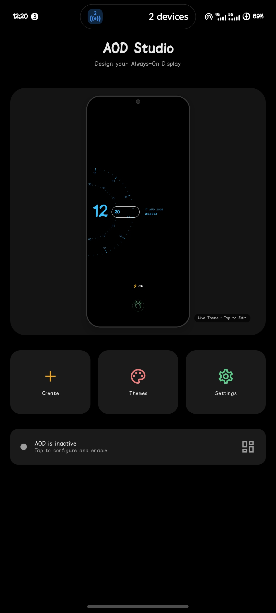
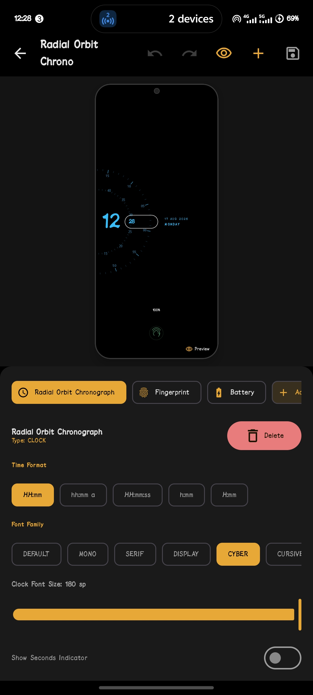

# AOD Studio

A custom Always-On Display (AOD) engine and visual theme editor for Android. Built with Jetpack Compose, a dedicated 2D Canvas rendering pipeline, hardware state monitors (battery, media, notifications), and AMOLED burn-in protection.

---

## Screenshots

> Place app screenshots in the [`screenshots/`](screenshots/) directory.

| Home & Status | Template Library | Visual Editor | Fullscreen Preview |
| :---: | :---: | :---: | :---: |
|  |  |  |  |

---

## Core Features

### 1. Template Library & Pool
- **Dynamic Category Filtering:** Filter templates by category (Orbit, Minimal, Digital, Typography, Retro, Neon, Custom). Adding a new template automatically populates its category with zero UI changes.
- **Live Card Previews:** Each template card runs a live miniature `AODRenderView` preview canvas.
- **Customized Badges:** Built-in templates display a `CUSTOMIZED` badge when user modifications deviate from the factory blueprint.
- **Single-Click Apply:** Directly applies the theme and starts the background AOD service with active status feedback.
- **Library Management:** Top-right action menu for template creation, refresh, and restoring default blueprints.

### 2. Interactive Visual Theme Editor
- **Device-Proportional Phone Frame:** The editor preview canvas matches exact phone proportions (`9:20`) with physical screen boundaries (bezel, rounded corners, front camera punch-hole) for unambiguous element placement.
- **Instant Fullscreen AMOLED Preview:** Tap the TopAppBar preview icon or tap/long-press the phone frame to launch a true `#000000` AMOLED fullscreen preview.
- **Modular Property Panel:** Tailored controls for each element type:
  - Layer selection and element deletion
  - X / Y coordinate sliders with center alignment snap guides
  - Element scale and rotation
  - Color picker and opacity
  - Typography style, weight, and font size
  - Notification icon scale slider and detailed text truncation
  - Battery layout variants (horizontal, vertical, percentage)
- **Undo / Redo Stack:** Full historical snapshot stack.

### 3. Clock Elements & Renderers
- **Radial Orbit Chronograph:** Dual concentric rotating dials (inner minutes dial, outer seconds dial) rotating with millisecond precision into a dual-chamber stadium capsule, flanked by large hour digits and date/day stack.
- **Comic Stack:** Bold comic-style yellow stacked time with angled day tag and circled date badge.
- **Minimal Outline:** Sleek outline-only stacked digits with vertical date pill.
- **Digital Bold & Retro:** Clean 12h/24h digital formats with custom font weights.
- **Minimal Analog:** Vector clock face with dial ticks and rotating hands.
- **Hardware Widgets:** Battery percentage, compact media playback controller, privacy-first notification badges, and vector fingerprint scanner.

### 4. AMOLED Burn-In Protection
- **Orbital Pixel Shift:** Periodic 5-minute x/y coordinate shifts along a smooth circular orbital trajectory bounded strictly within `±4px`.
- **Subpixel Opacity Capping:** Caps static element alpha to max `85%` (`0.85f`) to prevent static subpixel wear.

### 5. Lockscreen Overlay & Service
- **Screen-Off Lifecycle:** `AODForegroundService` listens for `ACTION_SCREEN_OFF` broadcasts and displays the AMOLED lockscreen surface via `AODWindowOverlayManager` (`TYPE_APPLICATION_OVERLAY`).
- **Touch Dismissal & Security:** Tap-anywhere or fingerprint press dismisses the overlay and returns to the system lock screen.

---

## Tech Stack

| Component | Technology |
| :--- | :--- |
| **Language** | Kotlin 2.3.21 |
| **UI Framework** | Jetpack Compose (Compose BOM 2026.06.00) |
| **Rendering** | Custom 2D Android Canvas (`AODRenderView`) |
| **Architecture** | Clean Architecture + MVVM |
| **Dependency Injection** | Hilt 2.60.1 |
| **Persistence** | DataStore + Internal Storage JSON |
| **Target SDK** | Android 16 (API 36) |
| **Minimum SDK** | Android 10 (API 29) |

---

## Project Structure

```text
app/src/main/java/com/aodstudio/app/
├── aod/
│   ├── lifecycle/          # BurnInManager, BootReceiver
│   ├── overlay/            # AODWindowOverlayManager (Window overlay)
│   ├── renderer/           # AODRenderer pipeline and Canvas element renderers
│   └── service/            # AODForegroundService (Screen off/on listener)
├── battery/                # BatteryRepository and state receiver
├── config/                 # ThemeConfig tokens and AppConfig constants
├── domain/
│   ├── model/              # AODTheme, AODElement, AODCanvas, AODStyle
│   ├── template/           # TemplateRegistry and TemplateDefinition blueprints
│   └── usecase/            # GetThemes, SaveTheme, DeleteTheme, ResetThemeUseCase
├── feature/
│   ├── clock/radial/       # RadialOrbitClockElement and RadialOrbitTokens
│   ├── editor/             # AODEditorScreen, AODEditorViewModel, PropertyPanel
│   ├── home/               # HomeScreen and AOD service toggle
│   ├── library/            # ThemeLibraryScreen, ThemeLibraryViewModel, TemplateCard
│   └── settings/           # SettingsScreen and permissions
├── media/                  # MediaRepository and MediaSession listener
└── notification/           # NotificationRepository and NotificationListenerService
```

---

## Build & Installation

### 1. Build Debug APK

```powershell
.\gradlew.bat assembleDebug
```

The APK will be generated at:
`app/build/outputs/apk/debug/app-debug.apk`

### 2. Run Tests

```powershell
.\gradlew.bat test
```

### 3. Install on Device via ADB

```powershell
adb install -r "app\build\outputs\apk\debug\app-debug.apk"
```

---

## Author

**Abhishek Maurya**

## License

MIT License.
